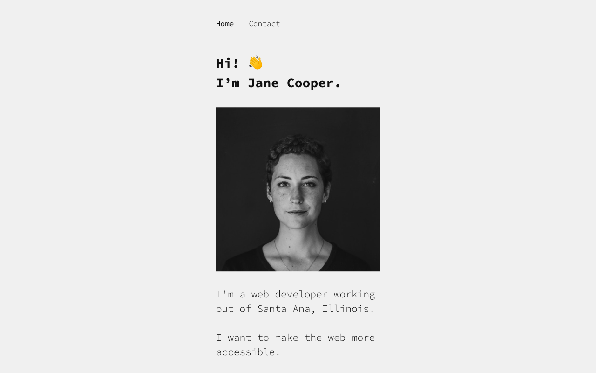

# react-portfolio-example

     
    <a href="https://react-portfolio-example.vercel.app/" target="_blank">
        
         
         
        <b>
            See it in action &mdash; react-portfolio-example.vercel.app
        </b>
    </a>
     
     

---

## Getting started

### Requirements

-   Node 12.18.1
-   NPM 6.14.5

### First steps

See [client README.md](./client/README.md) and [server README.md](./server/README.md) for more information.

## Scripts

### client:dev

Runs client app development environment.

See [client README.md](./client/README.md).

### client:build

Creates a production build of the client app.

See [client README.md](./client/README.md).

### server:dev

Runs server app development environment.

See [server README.md](./server/README.md).

### server:build

Creates a Netlify Functions-compatible build of the server app.

See [server README.md](./server/README.md).

### server:serve

Continuosly serves server app. Intended for production.

See [server README.md](./server/README.md).

### server:serve:stop

Stops serving server app.

See [server README.md](./server/README.md).

## Contributing

See [CONTRIBUTING.md](./CONTRIBUTING.md)
